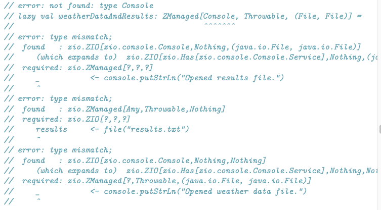

# 15.3 构造Managed资源
现在，我们了解了ZManaged是什么，以及它的功能多么强大，让我们花更多的时间研究如何在自己的代码中使用ZManaged。
在本节中，我们将重点介绍创建ZManaged值的不同方法。 然后，在接下来的部分中，我们将学习更多转换ZManaged值以构建更复杂资源的方法，以及最终使用这些资源的不同方法。
## 15.3.1基本构造函数
ZManaged值的最基本构造函数是`make`：
```
def make[R, E, A](acquire: ZIO[R, E, A])(release: A => URIO[R, Any]): ZManaged[R, E, A] = ???
```
该签名与本章前面讨论的ZManaged简化表示的构造函数完全相同，不同之处在于已对参数进行了改进类型推断。
这里要注意的一件事是，使用make构造函数，获取和释放操作都是不可中断的。 这是有道理的，因为我们之前曾说过ZManaged是bracket的一种形式，并且当我们使用bracket时，获取和释放动作都是不间断的。
从概念上讲，我们需要终结器不间断，因为终结器应该在资源使用完毕后运行，而不管资源的使用如何终止。 因此，如果资源使用中断，我们需要确保终结器本身不会被中断！
通常，不间断获取操作也很重要，以确保我们不会意外发现自己处于不确定状态。

如果获取效果成功，则可以确保运行释放效果以关闭资源。 但是，如果中断获取操作会发生什么呢？
我们无法执行释放操作来关闭资源，因为我们没有资源可以关闭。 但是获取动作可能仍然完成了一些需要完成的工作，例如，打开网络连接以打开远程服务器上的数据库连接。
因此，默认值是方括号和ZManaged的获取效果是不间断的。 通常，出于上述原因，这是正确的做法，但是在使用ZManaged时值得牢记。
如果您不想使获取效果不间断，则可以使用`makeInterruptible`变体来支持。
```
  def makeInterruptible[R, E, A](acquire: ZIO[R, E, A])
  (release: A => URIO[R, Any]): ZManaged[R, E, A] = ???
```
这与make完全一样，只是获得效果的可中断性发生改变。 释放动作仍将是不间断的。
这些构造函数还有一个更复杂的变体，称为makeReserve：
```
  def makeReserve[R, E, A](reservation: ZIO[R, E, Reservation[R, E, A]]): ZManaged[R, E, A] =
    ???
```
Reservation非常类似于我们对ZManaged的简单表示：
```
  final case class Reservation[-R, +E, +A](
      acquire: ZIO[R, E, A],
      release: Exit[Any, Any] => URIO[R, Any]
  )
```
Reservation描述了获取和释放操作，但此处释放操作采用退出值，从而使最终确定逻辑取决于获取操作如何完成（无论是成功，失败还是中断）。
要注意的关键是makeReserve构造函数接受ZIO效果作为参数，该效果返回Reservation。
这支持资源获取和使用的更复杂的两步模型：
1. Reservation-返回Reservation-的Reservation-效果是不间断的。
2. Acquisition-Acquisition的获取效果是可中断的。
尽管这种两步资源获取模式没有任何基础，但实际上在更高级的资源获取方案中它很有用。

一种常见的模式，特别是在处理并发数据结构时，是当我们希望在语义上阻止某个条件为真时，我们首先要进行一些内部bookkeeping，以将自己注册为等待某种状态（例如，获得许可）。可从Semaphore获得）。完成此操作后，我们需要暂停，直到我们收到条件成立的信号，然后我们才能继续。
在这种情况下，我们需要第一步“bookkeeping”步骤是不间断的，因为如果我们在更新了一个内部状态之后但在更新另一个内部状态之前被中断，则需要避免破坏数据结构的内部状态。使这种不间断也不成问题，因为更新内部状态的这些不同部分通常非常快。
相反，我们需要第二个“waiting”步骤是可中断的。例如，我们在等待许可证可用的时候就希望支持中断，如果我们不支持中断，我们可能会长时间等待，甚至可能永远等待。
因此，对于更高级的资源获取方案而言，makeReserve构造函数非常有用，并且就makeReserve而言，可以轻松地实现更简单的make和makeInterruptible构造函数。但是，如果您不需要makeReserve的全部功能，请坚持使用make和本节中讨论的其他构造函数。
还有一个makeExit构造函数，类似于make，但可以让您指定不同的逻辑，以便根据获取结果来最终确定资源。可以将其视为make和makeReserve之间的中介，因为它允许根据获取效果的终止方式指定不同的逻辑，但仍体现了一步资源获取过程。
```
  def makeExit[R, E, A](acquire: ZIO[R, E, A])(release: Exit[Any, Any] => URIO[R, Any]): ZManaged[R, E, A] =
    makeReserve(acquire.map(a => Reservation(ZIO.succeed(a), release)))
```
注意，在上面我们进行了acquire效果，然后通过其结果构造一个Reservation。 这样，acquire效果将是不间断的，这就是我们在这里想要的。

在很大的程度上make及其变种是ZManaged值的基本构造函数。大多数其他构造的只是方便的方法，使更容易构建在特定情况下ZManaged值。

15.3.2 便捷构造器
这些便利构造函数之一只是将ZIO值提升为没有任何释放动作的ZManaged值。
```
def fromEffect[R, E, A](zio: ZIO[R, E, A]): ZManaged[R, E, A] = ZManaged.makeInterruptible(zio)(_ => ZIO.unit)
```
这只是将ZIO值转换为ZManaged值，而无需添加任何终结逻辑，也不会更改ZIO值的可中断性。 您还可以通过在任何ZIO值上调用toManaged_来执行相同的操作。
您可能想知道为什么这很有用。 如果假定ZManaged值表示需要某种终结处理的资源，那么构造没有终结处理逻辑的ZManaged值有什么意义？
答案是它非常有用，因为它允许我们将所有现有的ZIO值与ZManaged值组成。 例如，考虑以下代码片段：
```
  lazy val weatherDataAndResults: ZManaged[Console, Throwable, (File, File)] = for {
    weatherData <- file("temperatures.txt")
    _ <- console.putStrLn("Opened weather data file.")
    results <- file("results.txt")
    _ <- console.putStrLn("Opened results file.")
  } yield (weatherData, results)
```

这似乎很简单。 我们只想在此资源的定义中添加一些调试逻辑即可按顺序打开天气数据和结果文件，以确保在使用完毕后安全关闭它们。
但是，这些代码不会像编写的那样编译！
文件返回ZManaged值，而putStrLn返回ZIO值。 flatMap和map运算符，要求组成的不同值具有相同的类型，即所有ZIO值或所有ZManaged值。
那么我们该怎么办呢？ 我们是否需要实现putStrLn等新版本才能在ZManaged的上下文中工作？
没有！ 要编译此代码，我们要做的就是使用toManaged_将ZIO值转换为ZManaged值。
```
  import zio.console._
  lazy val weatherDataAndResults: ZManaged[Console, Throwable, (File, File)] = for {
    weatherData <- file("temperatures.txt")
    _ <- putStrLn("Opened weather data file.").toManaged_
    results <- file("results.txt")
    _ <- putStrLn("Opened results file.").toManaged_
  } yield (weatherData, results)
```
现在我们的代码可以编译，我们可以添加调试语句，或其他任何我们喜欢的逻辑，以定义我们的资源。
这说明了一个很好的一般原则。通常，在开始使用其他ZIO效果类型（例如ZManaged）时，人们会遇到这样的情况：他们混合使用不同的效果类型（例如ZIO和ZManaged），导致代码无法编译或具有多个嵌套数据类型的复杂类型。
面对此问题时，最好的经验法则是将所有效果类型提升为“most”结构的效果类型。例如，如果您正在使用ZIO和ZManaged值的组合，请使用toManaged_将所有ZIO值提升为ZManaged值，然后所有内容将与flatMap，map，zip，foreach和collectAll之类的运算符完美地组合在一起。
之所以可行，是因为ZManaged具有比ZIO更多的结构，因此我们可以始终将ZIO值转换为ZManaged值，同时保留其含义。我们只是添加了一个什么都不做的终结器，因此我们完全添加了它的事实是完全不可观察的。
相反，如果我们尝试将ZManaged值转换为ZIO值，则会丢失信息。如果我们使用ZManaged值来获取ZIO值，我们将失去将其与其他资源进行组合以描述更复杂的资源的能力，因此我们希望避免这样做，直到我们确定完成对资源的定义。
ZIO上还有一个toManaged变体，它带有一个参数，允许您提供一个终结器，该终结器将在ZIO效果完成执行时运行。当您具有ZIO效果并返回一些需要完成的资源时，此功能特别有用。
```
  trait ZIO[-R, +E, +A] {
    self =>
    def toManaged[R1 <: R](release: A => URIO[R1, Any]): ZManaged[R1, E, A] =
      ZManaged.make(self)(release)
  }
```
例如，我们之前看到可以使用Queue.bounded之类的构造函数创建一个Queue，也可以使用shutdown操作符关闭Queue。 关闭队列将导致任何试图为队列提供值或从队列中获取值的光纤立即被中断。
如果我们直接使用这些构造函数之一，则我们有责任自行关闭队列，包括处理失败或中断的可能性。 如果我们改为将描述创建队列的ZIO值转换为ZManaged值，则可以自动为我们处理。
```
  val managedQueue: ZManaged[Any, Nothing, Queue[Int]] = Queue.bounded(16).toManaged(_.shutdown)
  // managedQueue: ZManaged[Any, Nothing, Queue[Int]] = zio.ZManaged$$anon$2@4d796656
```
然后，我们可以通过调用use来获得对Queue的访问权限，并确保在use操作完成执行时，该队列将自动关闭。 我们还可以将Queue与其他需要完成的资源组成。
除了这些用于从ZIO效果创建ZManaged值的构造函数之外，还有多种构造函数可用于将现有值或副作用代码导入到ZManaged值中，而无需通过ZIO。
例如，要将不会抛出异常的副作用代码导入ZManaged，我们可以这样做：
```
val helloWorldFromAManagedLong: ZManaged[Any, Nothing, Unit] = ZManaged.fromEffect(ZIO.effectTotal(println("Hello from a Managed!")))
// helloWorldFromAManagedLong: ZManaged[Any, Nothing, Unit] = zio.ZManaged$$anon$2@1e34dc0f
```
但是我们可以更简洁地完成以下操作：
```
val helloWorldFromAManaged: ZManaged[Any, Nothing, Unit] = ZManaged.effectTotal(println("Hello, World!"))
// helloWorldFromAManaged: ZManaged[Any, Nothing, Unit] = zio.ZManaged$$anon$2@6fce8757
```
对于您从ZIO熟悉的大多数常见运算符，例如succed，effect和effectTotal。ZManaged上都有相同的变体，只是它们返回ZManaged而不是ZIO值。 对于没有专门的ZManaged变体的构造函数，例如effectAsync，您可以仅在ZIO上使用构造函数，然后使用fromEffect或toManaged_将其转换为ZManaged值。